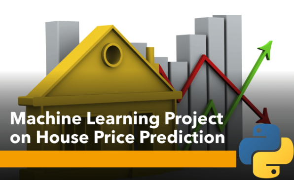
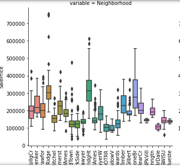
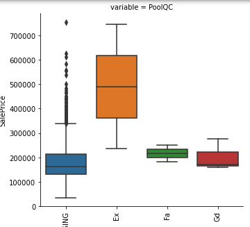
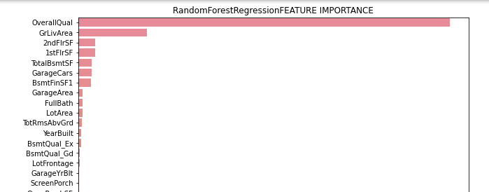
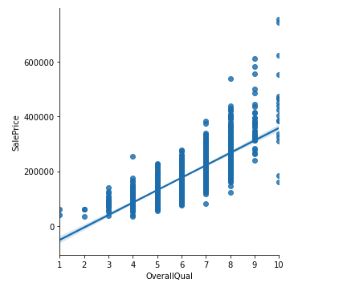
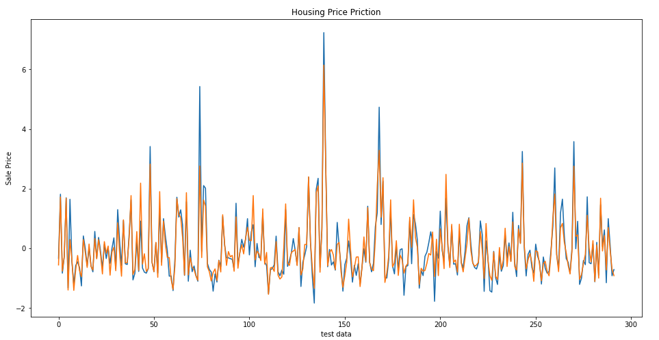

# House Price Prediction
To predict the final price of each home. 

Help people buy a house 
Know the price range in the future
Plan their finance 
Beneficial for property investors
Know the trend of housing prices in a certain location

### 
## Data
Data source: https://www.kaggle.com/competitions/house-prices-advanced-regression-techniques/overview

With 79 explanatory variables describing (almost) every aspect of residential homes in Ames, Iowa.

### Data Wrangling

## EDA

Full report: https://github.com/yuenyeelo/springboard/blob/main/Capstone2/YuenYeeLo_Capstone2_EDA.ipynb

Category data: We found that the neighborhood and the pool have impact on the SalePrice. 

## Machine Learning Modeling

### Baseline: Linear Regression
We first built a baseline system using Linear Regression. 

### Random Forest Regression
Random Forest Regression is an ensemble technique, which can perform regression and classification tasks with the use of multiple decision trees and a technique called Bootstrap Aggregation, commonly known as bagging. A decision tree offers a single path and considers all the features at once. So, this may create deeper trees making the model over fit. A Random forest creates multiple trees with random features, the trees are not very deep. For regression tasks, the mean or average prediction of the individual trees is returned. 

#### Features Selection
Random forest can give us insight about the feature importance. Reduce number of features can reduces the complexity of a model, easier to interpret and improves the accuracy if the right subset is chosen.  

##### Let take a look of the relationship between Overall Quality vs SalePrice

### Gradient Boosting

## Results
We measure our system using MAE, MSE, RMSE as result matric. We found that reduce features can improve the performance and 
gradient boosting performs the best amoung all three models.

Prediction from the gradient boosting regression model

## Conclusion
We built a baseline model using linear regression and compare to the random forest regression and gradient boosting regression. 
We performed feature selection from the features importance of RF and found that reducing features can improve the system performance. We also found that 
categories data show no significant impact. Gradient boosting regression performs the best
### Further improvement: 
Parameter tuning
Deep learning (if we have more data)

