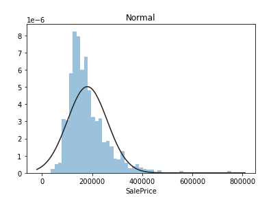
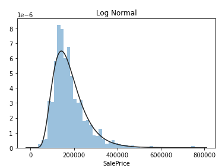
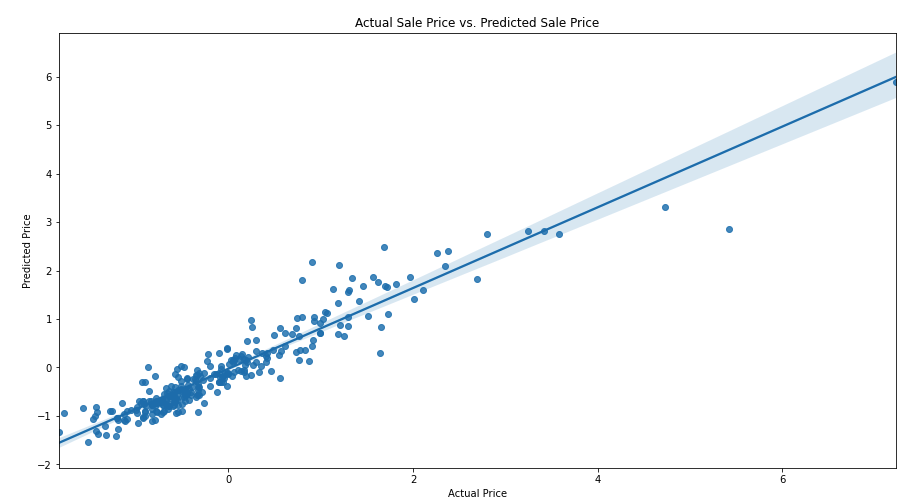

# House Price Prediction
House price prediction can help people to buy a house by predicting the price range, so buyers can plan their finance. It's also beneficial for property investors to know the trend of housing prices in a certain location.
Our goal is to predict the final price of each home. 

### 
## Data
Data source: https://www.kaggle.com/competitions/house-prices-advanced-regression-techniques/overview

The data was download from Kaggle, there are 1460 entries collected from Jan, 2006 to June, 2010.
With 79 explanatory variables describing (almost) every aspect of residential homes in Ames, Iowa. 43 of them are category data and 36 are numerical data.

### Data Wrangling

#### Numerical data
To handle the missing data, we replaced with the mean, there are not many missing numerical data. We then standardized the magnitude of numeric features using a scaler.

#### Category data
For Category data, there are a lot of missing data, for example, not many houses have pool, so most of the data in pool columns are missing. We replaced the missing data with 'MISSING'.  Then we created dummy or indicator features for categorical variables.

## EDA
First, we like to look at the sale price distribution, Normal distribution, log normal distribution and Johnson Su distribution (https://en.wikipedia.org/wiki/Johnson%27s_SU-distribution) , from the figures, we can see that the sale price fits better in Johnson Su distribution.

I am also interested to see how many house were sold as of the month of the year, we can see that more houses were sold during summer.

Category data: We found that the neighborhood and the pool quality (poolQC) have impact on the SalePrice. 

Full report: https://github.com/yuenyeelo/springboard/blob/main/Capstone2/YuenYeeLo_Capstone2_EDA.ipynb

## Machine Learning Modeling
Machine learning regression models are mainly used in predictive analytics to forecast trends and predict outcomes. Regression models will be trained to understand the relationship between different independent variables and an outcome.

### Baseline: Linear Regression
We first built a baseline system using Linear Regression. The advantages of linear regression are easier to implement, interpret and efficient to train. Linear regression assumes a linear relationship between the input and output varaibles, it fails to fit complex datasets properly. In most real life scenarios the relationship between the variables of the dataset isn't linear and hence a straight line doesn't fit the data properly.

### Random Forest Regression
Random Forest Regression is an ensemble technique, which can perform regression and classification tasks with the use of multiple decision trees and a technique called Bootstrap Aggregation, commonly known as bagging. A decision tree offers a single path and considers all the features at once. So, this may create deeper trees making the model over fit. A Random forest creates multiple trees with random features, the trees are not very deep. For regression tasks, the mean or average prediction of the individual trees is returned. 

#### Features Selection
Random forest can give us insight about the feature importance. Reduce number of features can reduces the complexity of a model, easier to interpret and improves the accuracy if the right subset is chosen.  

###### Let take a look of the relationship between Overall Quality vs SalePrice

### Gradient Boosting
The main difference between random forests and gradient boosting lies in how the decision trees are created and aggregated. Unlike random forests, the decision trees in gradient boosting are built additively; in other words, each decision tree is built one after another.
However, these trees are not being added without purpose. Each new tree is built to improve on the deficiencies of the previous trees and this concept is called boosting.

## Results
In regression task, we measure our system with difference between the original and predicted values in the test set. The lowest the difference, the better the model performs. There are 3 main matric: Mean Absolute Error (MAE), Mean Squared Error (MSE), Root Mean Squared Error (RMSE) as result matric.  We reported the baseline linear regression, random forest regression (all features and selected Top10 important features) and gradient boosting regression are reported. We found that reduce features can improve the performance and gradient boosting performs the best amoung all three models. 

#######

## Conclusion
We built a baseline model using linear regression and compare to the random forest regression and gradient boosting regression. 
We performed feature selection from the features importance of RF and found that reducing features can improve the system performance. We also found that 
categories data show no significant impact. Gradient boosting regression performs the best
### Further improvement: 
##### Deep Learning
Deep Learning is a subset of Machine Learning that achieves great power and flexibility by learning to represent the world as nested hierarchy of concepts, with each concept defined in relation to simpler concepts, and more abstract representations computed in terms of less abstract ones.
Deep learning (if we have more data), in general, deep learning can performs better if we have a lot of data. Deep learning to learn high-level features from data in an incremental manner. This eliminates the need of domain expertise and hard core feature extraction. We can use the data of SalePrice in USA, instead of one city, also include the average income, education level, etc. That may further improve the house price prediction and provide better insgiht to the buyers and invester.

##### Parameter tuning
Parameter tuning is a technique to optize the model, for example , in decision tree, random forest, we can tune the depth of the tree, number of nodes to split, or stop.  To furter improve the system, we would tune the parameters. 

