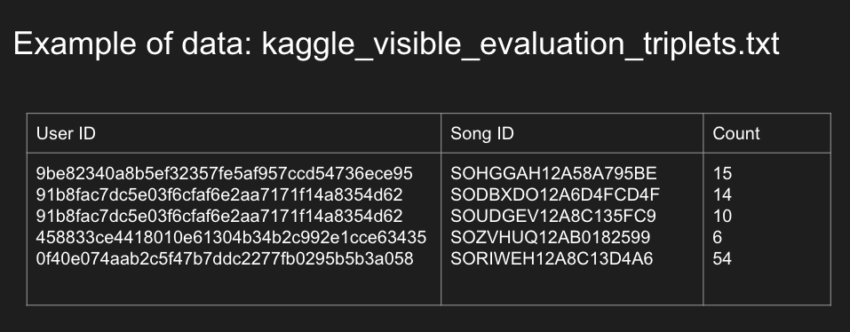
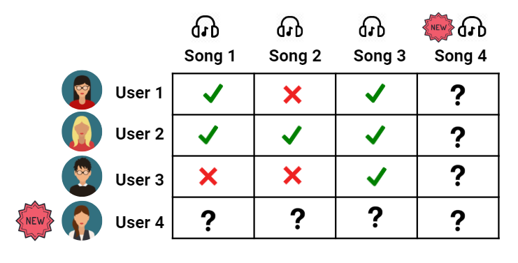
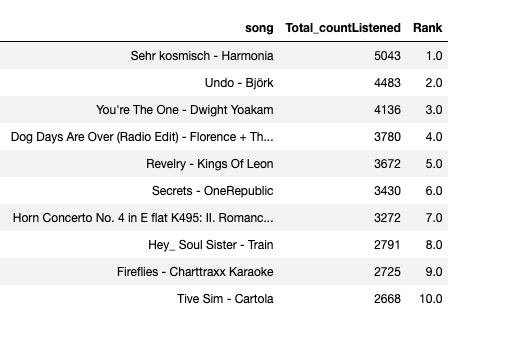
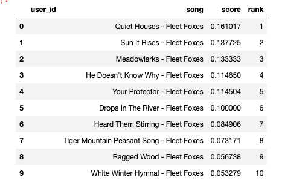
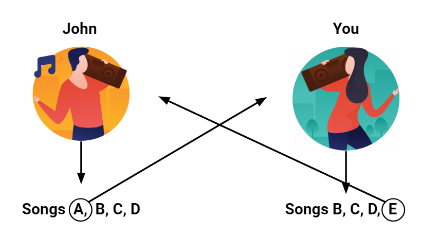
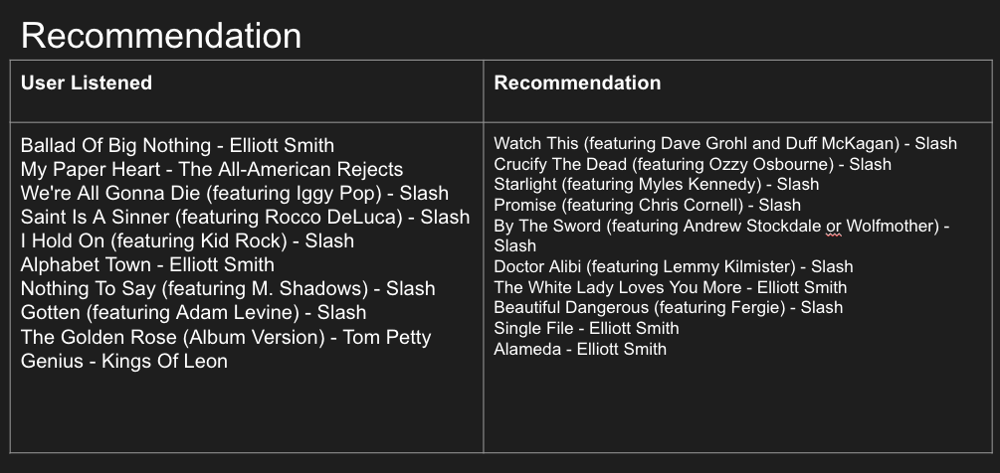
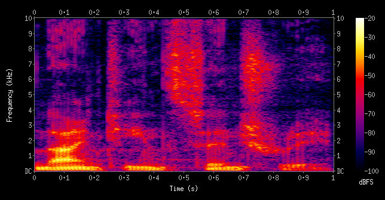
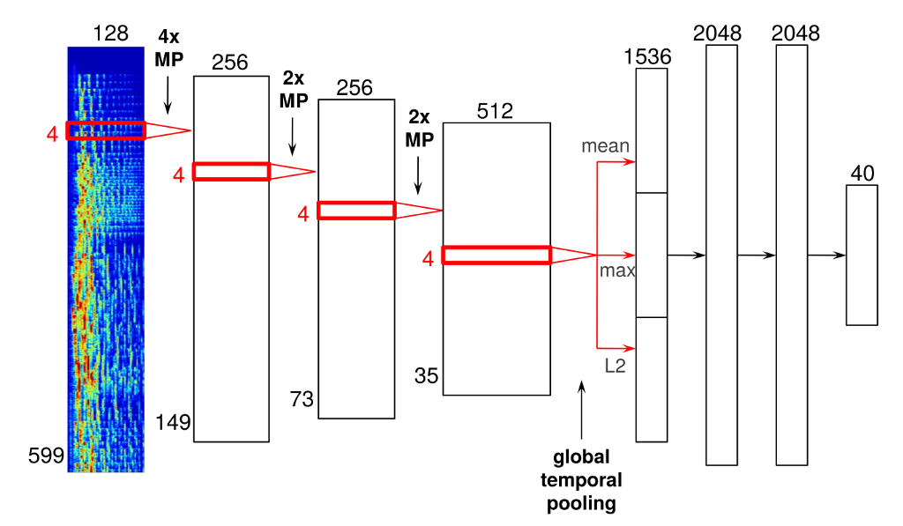

# Million Song Recommendation System

A Recommender system helps to personalize a platform and help users find what they are looking for. From a business perspective, the more relevant content or movies a user finds on any particular platform, the higher their engagement and as a result increased revenue.

Recommendation systems for the entertainment industry have become popular in recent years, such as Youtube, Netflix and Spotify are using different approaches to recommend video or music to users. A good recommendation system is able to ensure high-quality recommendations according to the user's taste. From Spotify to Amazon, recommendation systems provide users with quality and personalized recommendations.

 The goal of The Million Song Dataset Challenge is to predict the songs that a user will listen to, given both the user's listening history and full information (including meta-data and content analysis) for all songs. 

The Million Song Dataset Challenge aims at being the best possible offline evaluation of a music recommendation system.  Any type of algorithm can be used: collaborative filtering, content-based methods, web crawling, even human oracles!* By relying on the Million Song Dataset, the data for the competition is completely open: almost everything is known and possibly available.

Music recommendation, in particular, poses some interesting challenges due to the number of diverse genres available and the tendency of users to consume music sequentially. Furthermore, the relatively short duration of music in contrast to film or books makes analyzing audio challenging. However, this also means that songs are “disposable”, lowering the penalty for a bad recommendation.

Currently, music streaming giant Spotify has 286 million active users, 50 million tracks and over 4 billion playlists[2]. One of the reasons why Spotify is a big hit among other online music streaming platforms is the “Discover Weekly” playlist. Every Monday, Spotify gives its millions of users 30 new song recommendations.

### 
## Data Sources:
https://www.kaggle.com/competitions/msdchallenge

http://millionsongdataset.com/challenge/

https://github.com/tbertinmahieux/MSongsDB

List of all track Echo Nest ID. The format is: track id<SEP>song id<SEP>artist name<SEP>song title

Nubmer of songs: 386,213

Number of User:   110,000

Evaluation triples: 1,450,933 (user id, song id, count)

I also download the song titles , and artist name from Echo Nest, so it is easier for us to see if the songs are relevent.

The format is: track_id song_id artist_name song_title

### Data Wrangling
The data provided is very clean, there is no missing data non outliner.  I merged the Echo Nest dataset to the training data set. So we can see the artist name and the song title.

## Modeling

### Cold start problem. Popularity-model.
Cold start is when we have no history of the users, the recommendation system will provide a list of most popular songs. 

### Content-based methods
Content-based algorithms use the set of user history to generate a prediction. These systems employ statistical techniques to find a set of users known as neighbors, who have already agreed with the active user (ie they tend to listen to a similar set of items). Once this set of users is formed, these systems use different algorithms to combine the preferences of neighbors to produce a prediction or top-N recommendation for the active user.

If the user picked one song, we can find the similar songs for the user. Here is an example, if user picked "Oliver James Fleet Foxes", we can recommend 
similar songs to the users

### Collaborative filtering
Imagine you are at an office party. You run into John, the HR guy. You start a conversation about your musical interests and you find out that John had listened to songs A, B, C and D this week. It just so happens that you like songs B,C,D and E. You realise that the both of you have the same musical taste and so you decide to listen to song A. In turn, you tell John to listen to song E. This is exactly how collaborative filtering works!

Here is the recommendation for user "fdf6afb5daefb42774617cf223475c6013969724", we can see that the recommendation based on what the used listened. 

## Conclusion
We built a simple music recommendation system using three different methods: popularity, content-based and collaborative filtering. 

### Further improvement: 
#### More information about the songs
I am only using the song_id and user_id for my recommendation task. There are a lot of more information provided in this dataset, for example, music genre may be an important factor for user perference. Song-level tags and similarity can give us more insight about the songs.  We can use NLP technique to analyse the lyrics and their similarity. 

http://millionsongdataset.com/pages/additional-datasets/
- Cover songs: SecondHandSongs dataset.
- Lyrics: musiXmatch dataset.
- Song-level tags and similarity: Last.fm dataset.
- User listening data: Taste Profile subset
- User listening data: thisismyjam-to-MSD mapping
- Genre labels from last.fm and beatunes: tagtraum genre annotations
- Genre labels from the All Music Guide: Top MAGD dataset

#### Natural Language Processing : Song title and lyric, artists, songs and user preferences
From the song title and/or Lyrics, we can using NLP to see if there are similarity. For example, people enjoy romantics songs may like listen other romantics songs. People like rap song , may also like to listen other rap song.

#### Cold Start Problem using CNN Model
Collaborative filtering seems to work well. But how do people find a song that hasn't been streamed before?

This problem is known as the “cold start problem”. The cold start problem is a situation where new songs fail to get recommended due to a lack of listening data. Moreover, because collaborative filtering relies on listening data alone, popular songs tend to monopolize recommendations.

But how do we overcome this problem? By processing the song itself! Raw audio, however, is difficult to analyse, so a spectrogram is used instead. If you could take a picture of music, it would be a spectrogram!

Spotify processes this raw audio by converting it to a mel spectrogram and passing it through a convolutional neural network (CNN). A mel spectrogram is a time-frequency representation of the audio, where the frequencies are converted to the mel scale. The mel scale is a nonlinear scale that closely approximated the human hearing response.

Here is an example of what the architecture may look like. This architecture comprises four convolutional layers and three fully-connected layers.

#### Project ideas and proposal:
https://docs.google.com/document/d/1bybbHktaNtRWpOuZq8H2j6U6X1n7m4VKFeroqADNNYM/edit?usp=sharing
https://docs.google.com/document/d/17e3VP4f4s_cnssqMTAmYqmXfuDhb5LBZtTl_VWck-fo/edit?usp=sharing
